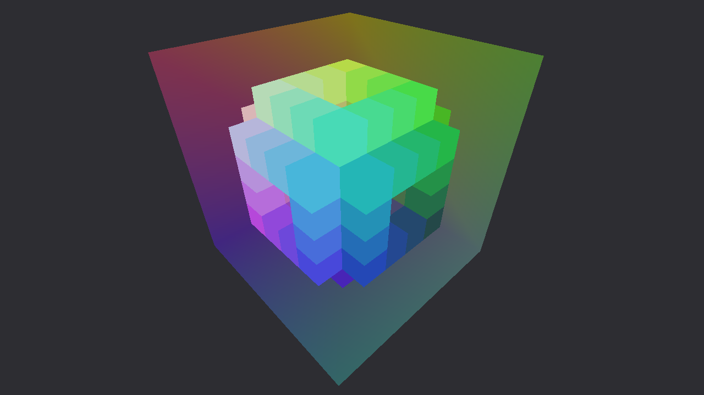

## Raymarching over voxel volume inside a cube using a fragment shader
Fragment shader requires two important variables: `origin` and `direction`, which are given as interpolated values between vertices of the cube for any given pixel coordinate. Vertex shader calculates `origin` by transforming camera position into local space of the cube, like this:
```glsl
vec3 origin = inverseModel * vec4(cameraPosition, 1.0)
```
Because `origin` is positioned in local space of the cube, it becomes very simple to calculate direction of the ray, like this:
```glsl
vec3 direction = origin - vertexPosition;
```

Fragment shader normalizes interpolated `direction` and adjusts `origin` so that it starts inside of the cube. While stepping through 8x8x8 volume using DDA algorithm, we are checking if the current voxel is solid, and if so, we exit the loop. In this example by "solid", we mean that the color of the voxel in the texture is greater than zero.

Additionally, we check if our sampling point is out of bounds, to prevent a bug, that looks like domain repetition in some way. This bug is prominent in situations when you have voxels on the border of the volume (0x0x0 or 8x8x8 for example).

The size of the volume can be tweaked by fiddling with `COUNT_VOXELS`. Note, that the more voxels you have, the more `COUNT_STEPS` it will require to traverse it.

---

This project is based on my previous work: raymarching over a signed distance field inside a cube (https://github.com/kallisto56/Raymarching-inside-cube).

Current implementation makes it possible to render each cube with its own position, rotation, and scale, this is because fragment shader operates inside clip-space. The only thing it does not supports is vertex-deformation. If you've managed to make a deformable variation out of this and are willing to share the source code, please contact me (https://twitter.com/aeon56).

---

### References
- DDA algorithm by **fb39ca4**: https://www.shadertoy.com/view/4dX3zl
- Algorithm for determining intersection points between ray and the cube is taken from: https://gist.github.com/DomNomNom/46bb1ce47f68d255fd5d
which, according to the comment left by author, was adapted from: https://github.com/evanw/webgl-path-tracing/blob/master/webgl-path-tracing.js
- "Hello Cube" example project that I've used to get started was made by **c2d7fa**: https://github.com/c2d7fa/opengl-cube

### Inspiration
- Dreams PS4 Umbra Ignite (Alex Evans): https://www.youtube.com/watch?v=u9KNtnCZDMI
- Drawing MILLIONS of voxels on an integrated GPU with parallax ray marching (Douglas): https://www.youtube.com/watch?v=h81I8hR56vQ

----

[](https://www.buymeacoffee.com/kallisto56)